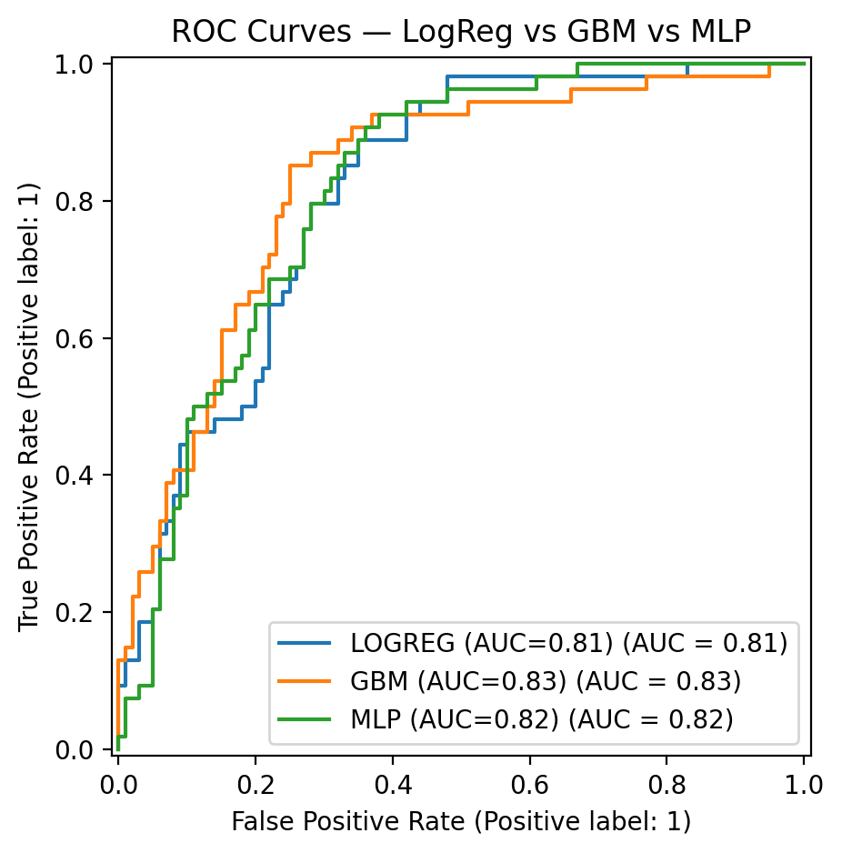

# Interpretable Machine Learning — Diabetes (Pima) 🩺


---

## ROC Curves


## Project Work
# Interpretable ML for Diabetes Prediction: Balancing Accuracy and Transparency

## Main Question
How can **interpretable** and **black-box** models be compared and explained for predicting diabetes on **Pima Indians Diabetes** data, and which clinical features drive predictions at **local** and **global** levels?

## Project Overview
This project builds an end-to-end pipeline for:

- **Training & Evaluation**
  - **Logistic Regression** (interpretable baseline)
  - **Gradient Boosting (GBM)** (powerful tree ensemble)
  - **Neural Network (MLP)** (black-box)
- **Interpretability**
  - **LIME** (local)
  - **SHAP** (local + global)
  - **Permutation Importance** (global)
- **Validation**
  - **Stratified 5-fold cross-validation**
  - **Leakage-safe pipelines** (imputation and scaling *inside* the pipeline)

The goal is to balance **performance** with **explainability**, making results both clinically useful and trustworthy.

---

## Datasets

**Source:** Pima Indians Diabetes — UCI / OpenML #37  
- **Samples:** 768 patients  
- **Features (8):** `preg, plas, pres, skin, insu, mass, pedi, age`  
- **Target:** `class` (0 = not affected, 1 = affected)

**Class distribution**  
- Diabetes = 1: 268 (35%)  
- Diabetes = 0: 500 (65%)

### Data Cleaning (zeros-as-missing)

| Short | Long Name        | Meaning                                   | Zero Handling     |
|------:|------------------|-------------------------------------------|-------------------|
| preg  | Pregnancies      | Number of pregnancies                     | keep zeros        |
| plas  | PlasmaGlucose    | 2-hr plasma glucose (OGTT)                | zeros → missing   |
| pres  | BloodPressure    | Diastolic blood pressure (mm Hg)          | zeros → missing   |
| skin  | SkinThickness    | Triceps skinfold thickness (mm)           | zeros → missing   |
| insu  | Insulin          | 2-hr serum insulin (µU/ml)                | zeros → missing   |
| mass  | BMI              | Body Mass Index                           | zeros → missing   |
| pedi  | DiabetesPedigree | Genetic/family risk index                 | keep zeros        |
| age   | Age              | years                                     | keep              |

**Imputation:** median per feature (done inside pipelines to avoid leakage).  
**Scaling:** applied for LogReg, MLP; **not** needed for trees (GBM).

---

## Repository Structure

```text
interpretable_ml_project/
├─ README.md
├─ LICENSE
├─ requirements.txt
├─ data/
│  ├─ pima_diabetes_clean.csv
│  ├─ pima_diabetes_clean_long.csv
├─ outputs/
│  ├─ figures/        # all plots saved here
│  │   ├─ roc_all.png
│  │   ├─ cm_logreg.png, cm_gbm.png, cm_mlp.png
│  │   ├─ lime_gbm.png, lime_mlp.png
│  │   ├─ shap_waterfall_gbm.png, shap_waterfall_mlp.png
│  │   ├─ shap_bar_gbm.png, shap_bar_mlp.png, shap_beeswarm_gbm.png
│  │   ├─ perm_importance_logreg.png, perm_importance_gbm.png, perm_importance_mlp.png
│  │   └─ class_balance.png
│  └─ metrics/
│      ├─ metrics.json
│      └─ crossval_metrics.csv
├─ notebooks/
│  └─ diabetes_interpretability.ipynb   # optional notebook
├─ src/
│  ├─ utils.py          # data loading/cleaning, constants
│  ├─ train_evaluate.py # training, ROC, CV
│  └─ interpret.py      # LIME, SHAP, permutation importance
└─ reports/
   └─ Interpretable ML Report.pdf / .pptx

```

---

## Installation and Usage

```bash
# 1) Clone the repository
git clone https://github.com/<your-username>/interpretable_ml_project.git
cd interpretable_ml_project

# 2) Create environment and install dependencies
conda create -n iml2 python=3.10 -y
conda activate iml2
pip install -r requirements.txt

# 3) Train models and save metrics/figures
python -m src.train_evaluate

# 4) Generate interpretability figures (LIME/SHAP/Permutation)
python -m src.interpret
```

## Outputs include

outputs/figures/roc_all.png

outputs/figures/cm_logreg.png, cm_gbm.png, cm_mlp.png

outputs/figures/lime_gbm.png, lime_mlp.png

outputs/figures/shap_waterfall_gbm.png, shap_waterfall_mlp.png

outputs/figures/shap_bar_gbm.png, shap_beeswarm_gbm.png, shap_bar_mlp.png

outputs/figures/perm_importance_logreg.png, perm_importance_gbm.png, perm_importance_mlp.png

outputs/metrics/metrics.json, outputs/metrics/crossval_metrics.csv

outputs/figures/class_balance.png

## Models & Pipelines

## Logistic Regression (interpretable)

Imputer(median) → StandardScaler → LogisticRegression(max_iter=1000)


## Gradient Boosting (GBM)

Imputer(median) → GradientBoostingClassifier(
    n_estimators=200, learning_rate=0.05, max_depth=3
)


## Neural Network (MLP)

Imputer(median) → StandardScaler → MLPClassifier(
    hidden_layer_sizes=(64, 32), max_iter=1000
)

## Cross-Validation (Leakage-Safe)

Stratified 5-fold CV with shuffling and fixed seed

Pipelines fit only on the training split of each fold (no leakage)

Metrics per fold: Accuracy, F1 (binary), ROC_AUC (from predict_proba)

Reported as mean ± std across folds; same folds reused for all models

## Results (example values)

### Hold-out (80/20 split)
| Model              | Accuracy | Precision | Recall | F1   | ROC-AUC |
|--------------------|----------|-----------|--------|------|---------|
| Logistic Regression | 0.77     | 0.73      | 0.58   | 0.64 | 0.81    |
| Gradient Boosting   | 0.76     | 0.68      | 0.60   | 0.63 | 0.83    |
| MLP (Neural Net)    | 0.73     | 0.60      | 0.61   | 0.61 | 0.82    |

### 5-fold Cross-Validation (mean ± std)
| Model              | Accuracy         | F1              | ROC-AUC         |
|--------------------|------------------|-----------------|-----------------|
| Logistic Regression | 0.772 ± 0.017   | 0.636 ± 0.021   | 0.842 ± 0.015   |
| Gradient Boosting   | 0.759 ± 0.025   | 0.634 ± 0.041   | 0.835 ± 0.018   |
| MLP (Neural Net)    | 0.724 ± 0.017   | 0.605 ± 0.038   | 0.780 ± 0.012   |

# Interpretability Tools

## LIME (Local)
Explains one prediction by fitting a simple surrogate model around that instance.
Saved plots: lime_gbm.png, lime_mlp.png.

## SHAP (Local + Global)
Shapley values assign a fair contribution to each feature.

TreeExplainer for GBM (fast, exact-ish for trees)

KernelExplainer for MLP (model-agnostic, with a small background set)
Saved plots: shap_waterfall_*.png, shap_beeswarm_*.png, shap_bar_*.png.

## Permutation Importance (Global)
Measures the drop in performance when a feature is shuffled.
Saved plots: perm_importance_*.png.

Consensus: plas (glucose) and mass (BMI) dominate; age, pedi are moderate.

Tools and Technologies

Python: scikit-learn, SHAP, LIME, NumPy, Pandas

Visualization: Matplotlib, Seaborn

Version Control: Git, GitHub

## Reproducibility & Tips

Use RANDOM_STATE=42 everywhere (splits, models, sampling)

Fixed patient_idx=16 for local explanations

Avoid shap.initjs() in scripts (for notebooks only)

KernelExplainer: keep background ≤ 100 rows for speed

Increase max_iter for MLP if you see ConvergenceWarning

## Troubleshooting

ModuleNotFoundError: src
Run from the project root:

python -m src.train_evaluate
python -m src.interpret


LIME truncnorm error
Already mitigated via discretize_continuous=False and imputing first.

MLP ConvergenceWarning
Increase max_iter, tune learning rate; scaling already enabled.

## 📄 Report
The full scientific report (8–10 pages, LNCS format) is available here:  
[Interpretable ML for Diabetes Prediction Report (PDF)](reports/Interpretable_Machine_Learning_for_Diabetes_Prediction__Balancing_Accuracy_and_Transparency.pdf)

## References

Ribeiro et al., KDD 2016 — LIME

Lundberg & Lee, NeurIPS 2017 — SHAP

Friedman, Annals of Statistics 2001 — GBM

Pedregosa et al., JMLR 2011 — scikit-learn

Dua & Graff — UCI Repository (Pima)

Authors and Acknowledgment

Project by As Am Mehedi Hasan.
Thanks to FAU and course instructors for guidance and feedback.

## License

This project is licensed under the MIT License — see LICENSE.